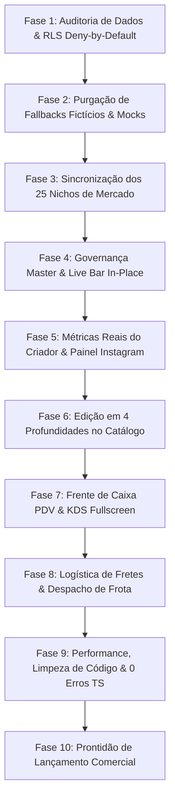

# MASTER_AUDIT_SUPER_PROMPT.md — O Super Prompt Supremo & Inventário Canônico 360° (Wider Community Platform)

> **Documento Canônico VINCULANTE e ABSOLUTO de Engenharia, Produto, Dados e Design**  
> Elaborado pelo **Conselho Executivo de Engenharia BigTech** (CPO, Chief Software Architect, Staff Security & Supabase Master, Principal Design Ops Director e Staff QA Gatekeeper).  
> **Propósito:** Consolidar rigorosamente todas as centenas de prompts, requisitos, módulos, rotas, funções do BFF, tabelas do Supabase e regras de bilateralidade do ecossistema WIDER, garantindo **Completude Quádrupla**, **Zero Fallbacks Falsos**, **Zero Simulações**, **100% de Editabilidade Bilateral** e **Prontidão de Lançamento Comercial**.

---

## 🏛️ 1. OS 7 PRINCÍPIOS FUNDACIONAIS DO CONSELHO BIGTECH

1. **A Regra da Bilateralidade Estrita & Completude Quádrupla (Inviolável):**  
   Todo e qualquer elemento visível na plataforma (banner, botão de categoria, produto, notícia, classificado, rota, imagem de login, termo de uso, regra de frete ou taxa) **consome obrigatoriamente uma tabela real do Supabase** e **possui uma interface de gestão (CRUD/CMS) correspondente**:
   - **Camada 1 (Banco de Dados):** Tabela relacional com PK, FKs, tipos estritos, índices, triggers e RLS deny-by-default via migration aplicada.
   - **Camada 2 (BFF & Contratos):** Server Functions (`createServerFn`) com schema Zod rigoroso, validação de autoridade e isolamento multi-tenant por sessão (`getServerIdentity()`).
   - **Camada 3 (UI de Ação / Consumo):** Componente interativo com feedback em tempo real, estados de loading (skeleton), erro resiliente e validação nativa.
   - **Camada 4 (Superfície de Gestão / Governança):** Painel operacional dedicado (Admin Master para governança global do ecossistema; Workspace para governança da loja/negócio; Perfil/Conta para governança do morador/criador).

2. **Proibição Total de Mocks, Fallbacks Fictícios e Toasts Vazios:**  
   - É terminantemente PROIBIDO simular contagens (ex: `postsCount * 8`), inventar números de seguidores, gerar métricas artificiais ou exibir botões que apenas disparam `toast("Em breve")` sem mutação real no banco.
   - Se uma loja não configurou entrega, o sistema exibe estritamente o status real ("Apenas Retirada no Local" ou "Entrega sob Cotação"); se não há banners cadastrados, exibe o Empty State com convite de criação ao administrador; se não há produtos, exibe o estado vazio limpo.

3. **A Dualidade de Design System (Paradigma Clean vs Editorial Zine):**  
   - **Ambiente Operacional (Workspace, PDV, Gestor, Checkout, Painel Master, Configurações):** Segue rigorosamente o **"Paradigma Clean"**: superfície neutra (`surface-paper`), fundo branco suave (`bg-background`), bordas ultrafinas de 1px (`border-border/60`), cantos `rounded-xl` a `rounded-2xl`, zero sombras pesadas e tipografia funcional sem ruídos.
   - **Ambiente de Publicação Pública (Flyers, Biolinks, Zines, Mídia Cultural):** Camada editorial rica e expressiva, ativada exclusivamente sob escolha do criador.

4. **Silêncio Visual na Vitrine Pública (Regra 11):**  
   - Nenhuma página pública de descoberta (Home, Mercado, Gastronomia, Farmácia, Notícias, Agenda, Turismo, etc.) pode conter títulos prolixos de boas-vindas ("Bem-vindo ao Mercado...") ou `<h2>`/`<h3>` redundantes que competem com os cards.
   - A navegação é direta e visual através de: Banners Imersivos 21:9, Chips Rápidos com textura/mídia, `DiscoveryControlBar` e carrosséis com `hideHeader={true}`.

5. **Isolamento Multi-Tenant Inviolável & Modo Olho de Deus Auditável:**  
   - Mutações de lojas exigem `assertStoreAccess(storeId)` derivado da sessão JWT.
   - O Super Admin Master (`platform_admin`) possui poder de supervisão global com **Impersonate Seguro em 1 Clique** e auditoria forense imutável de todas as ações em `forensic_audit_events`.

6. **Dinheiro = Integer Cents (BRL):**  
   - Todos os valores monetários são obrigatoriamente persistidos em centavos inteiros (ex: R$ 19,90 = `1990`). A formatação visual é responsabilidade única da camada de renderização (`formatMoney`).

7. **Edição Operacional em 4 Profundidades:**  
   - **Profundidade 1 (Célula):** Edição rápida inline direto na tabela (Preço, Estoque, Switch Ativo/Inativo).
   - **Profundidade 2 (Linha):** Alteração de pequenos grupos de campos relacionados.
   - **Profundidade 3 (Lateral - Drawer/Side Panel):** Painel deslizante para ajuste de fotos, complementos e tags sem perder a lista de vista.
   - **Profundidade 4 (Página Completa):** Edição aprofundada com *Truthful Preview* lateral em tempo real.

---

## 🗺️ 2. MAPEAMENTO COMPLETO DOS 25 NICHOS & VERTICAIS DO ECOSSISTEMA

Cada uma das 25 verticais do ecossistema possui **Banners Próprios**, **Botões/Chips Próprios**, **Rotas Públicas Dedicadas** e **Governança no Admin Master**:

| # | Nicho / Vertical | Rota Canônica | Placement de Banners | Módulo de Botões | Tipo de Ofertas / Conteúdo |
|---|---|---|---|---|---|
| 1 | **Home / Início Geral** | `/_store.index.tsx` (`/`) | `home` | `home` | Discovery Hub Central Multi-Nicho |
| 2 | **Supermercado & Feira** | `/_store.mercado.tsx` (`/mercado`) | `mercado` | `mercado` | Gôndola Densa, Encarte da Semana, Corredores |
| 3 | **Gastronomia & Delivery** | `/_store.gastronomia.tsx` (`/gastronomia`) | `gastronomia` | `gastronomia` | Cardápios, Pratos, Combos, Tempo de Cozinha |
| 4 | **Farmácia & Saúde** | `/_store.farmacia.tsx` (`/farmacia`) | `farmacia` | `farmacia` | Medicamentos, Higiene, Cosméticos, Plantão |
| 5 | **Bebidas & Adega** | `/_store.bebidas.tsx` (`/bebidas`) | `bebidas` | `bebidas` | Cervejas, Vinhos, Destilados, Packs Gelo |
| 6 | **Açougue & Carnes** | `/_store.acougue.tsx` (`/acougue`) | `acougue` | `acougue` | Cortes Especiais, Kits Churrasco, Peixes |
| 7 | **Moda & Vestuário** | `/_store.moda.tsx` (`/moda`) | `moda` | `moda` | Looks, Roupas, Calçados, Grades Tamanho/Cor |
| 8 | **Eletrônicos & Tech** | `/_store.eletronicos.tsx` (`/eletronicos`) | `eletronicos` | `eletronicos` | Gadgets, Smartphones, Hardware, Acessórios |
| 9 | **Pet Shop & Veterinária** | `/_store.pet.tsx` (`/pet`) | `pet` | `pet` | Rações, Banho & Tosa, Acessórios Pet |
| 10 | **Serviços & Profissionais** | `/_store.servicos.tsx` (`/servicos`) | `servicos` | `servicos` | Consultoria, Manutenção, Autônomos, Orçamentos |
| 11 | **Imóveis & Locação** | `/_store.imoveis.tsx` (`/imoveis`) | `imoveis` | `imoveis` | Casas, Apartamentos, Terrenos, Aluguel |
| 12 | **Construção & Reforma** | `/_store.construcao.tsx` (`/construcao`) | `construcao` | `construcao` | Materiais, Ferramentas, Elétrica, Pintura |
| 13 | **Casa & Decoração** | `/_store.casa.tsx` (`/casa`) | `casa` | `casa` | Móveis, Utensílios, Iluminação, Têxtil |
| 14 | **Beleza & Estética** | `/_store.beleza.tsx` (`/beleza`) | `beleza` | `beleza` | Salões, Barbearias, Estética, Agendamento |
| 15 | **Limpeza & Utilidades** | `/_store.limpeza.tsx` (`/limpeza`) | `limpeza` | `limpeza` | Produtos de Limpeza, Descartáveis, Embalagens |
| 16 | **Livros & Papelaria** | `/_store.livros.tsx` (`/livros`) | `livros` | `livros` | Livraria, Material Escolar, Escritório |
| 17 | **Portal de Notícias** | `/_store.noticias.index.tsx` (`/noticias`) | `noticias` | `noticias` | Matérias Locais, Editoriais, Jornalismo |
| 18 | **Agenda & Eventos** | `/_store.agenda.tsx` (`/agenda`) | `agenda` | `agenda` | Shows, Festas, Workshops, Ingressos QR |
| 19 | **Turismo & Roteiros** | `/_store.turismo.index.tsx` (`/turismo`) | `turismo` | `turismo` | Hotéis, Pousadas, Pontos Turísticos, Cotações |
| 20 | **Empregos & Oportunidades** | `/_store.empregos.tsx` (`/empregos`) | `empregos` | `empregos` | Vagas de Trabalho, Banco de Talentos, Estágios |
| 21 | **Classificados P2P** | `/_store.classificados.index.tsx` (`/classificados`) | `classificados` | `classificados` | Desapegos, Usados, Negociações Diretas |
| 22 | **Diretório Comercial** | `/_store.diretorio.index.tsx` (`/diretorio`) | `diretorio` | `diretorio` | Guia Oficial de Lojas, Empresas e Contatos |
| 23 | **Mobilidade & Corridas** | `/_store.mobilidade.tsx` (`/mobilidade`) | `mobilidade` | `mobilidade` | Chamada de Motoristas, Entregas, Mapa GPS |
| 24 | **Ofertas Relâmpago** | `/_store.ofertas.tsx` (`/ofertas`) | `ofertas` | `ofertas` | Tabloide Unificado, Timers, Descontos |
| 25 | **Mural Social & Moments** | `/_store.mural.tsx` (`/mural`) | `home` | `social` | Feed Urbano, Stories, Reels, Debates |

---

## 📊 3. INVENTÁRIO COMPLETO DE MÓDULOS, ROTAS, BFF FUNCTIONS & TABELAS

### MÓDULO 1: SUPER ADMIN MASTER (GOVERNANÇA GLOBAL DA PLATAFORMA)
- **Rotas:**
  - `/admin-master`: Dashboard executivo com métricas consolidadas de lojas, pedidos, GMV, usuários ativos e integridade da infraestrutura.
  - `/admin-master/banners`: Gestor de banners segmentado por 25 abas de nichos, controle de `show_overlay`, links internos/externos e contadores em tempo real.
  - `/admin-master/botoes`: Gestor de botões de navegação e sub-headers por nicho com upload de mídia (vídeo/GIF/imagem), texturas e Live Preview.
  - `/admin-master/hubs`: Gestor de corredores e hubs temáticos da cidade.
  - `/admin-master/lojas`: Lista global de empresas com **Impersonate em 1 Clique**, status, plano, faturamento e exportação CSV.
  - `/admin-master/marca`: Split de login customizável, logo/favicon global, horários e canais de suporte da plataforma.
  - `/admin-master/termos`: CMS dos Termos de Uso, Política de Privacidade e Regras Gerais com versionamento.
  - `/admin-master/usuarios`: Gestão global de usuários, perfis, atribuição de papéis (`platform_admin`, `merchant`, `customer`) e banimento/suspensão.
  - `/admin-master/integracoes`: 6 abas de governança de APIs (Mapas, Pagamentos, WhatsApp/SMS, Fretes, IA e Webhooks com HMAC).
  - `/admin-master/logs`: Auditoria forense imutável de mutações no sistema.
- **Tabelas do Banco:** `stores` (raiz), `banners`, `hotpage_cards`, `profiles`, `forensic_audit_events`, `system_terms`, `integration_credentials`.
- **BFF Functions:** `master.functions.ts`, `banner.functions.ts`, `hotpage.functions.ts`, `integrations.functions.ts`.

---

### MÓDULO 2: PERFIL DO MEMBRO, SOCIAL & PAINEL PROFISSIONAL
- **Rotas:**
  - `/_store/membro/$id`: Perfil público minimalista (Instagram/Threads) com Capa Panorâmica de 2098px com scroll fluido, avatar 1:1, status de disponibilidade, alternância Social/Profissional/Comercial e métricas reais.
  - `/_store/conta/metricas`: **Painel Profissional & Creator Insights** com alcance real, engajamento calculado sobre reações reais, crescimento de audiência (7d/30d), distribuição de formatos de post e ranking de Top Posts.
  - `/_store/conta/perfil`: Edição completa do perfil pessoal (Nome, @username, Bio, Foto, Capa, Ocupação, Cidade, Redes Sociais, Biolinks e Currículo).
  - `/_store/mural`: Feed social da cidade com Stories efêmeros, abas [Pra Você / Seguindo / Moments / Desapegos] e gaveta de criação 100% fullscreen no mobile.
- **Tabelas do Banco:** `profiles`, `posts`, `post_likes`, `post_comments`, `post_media_likes`, `user_followers`, `stories`.
- **BFF Functions:** `social.functions.ts` (`getPublicMemberProfile`, `getMemberAnalyticsInsights`, `togglePostLike`, `createPost`, `toggleUserFollow`).

---

### MÓDULO 3: CATÁLOGO, PRODUTOS, VARIAÇÕES & ESTOQUE (WORKSPACE)
- **Rotas:**
  - `/workspace/catalogo/produtos`: Tabela densa de produtos com **Edição de Célula inline**, filtros de categoria/status e ações em lote.
  - `/workspace/catalogo/produtos/$id`: Formulário de produto em profundidade 4 com seções completas e *Truthful Preview* lateral em mockup smartphone.
  - `/workspace/catalogo/categorias`: Gestor em árvore de categorias e subcategorias com ordenação drag-and-drop e ícones.
  - `/workspace/catalogo/atributos`: Wizard de criação de grupos de opcionais/complementos (Carnes, Molhos, Pontos, Tamanhos) com regras de seleção e franquias.
  - `/workspace/estoque`: Gestão de almoxarifado, alerta de estoque crítico, rupturas e modal de ajuste de balanço com justificativa obrigatória.
- **Tabelas do Banco:** `products`, `product_categories`, `product_variants`, `product_option_groups`, `product_option_items`, `inventory_levels`, `inventory_transactions`.
- **BFF Functions:** `catalog.functions.ts`, `inventory.functions.ts`, `category.functions.ts`.

---

### MÓDULO 4: VENDAS, PEDIDOS, PDV & FRENTE DE CAIXA (WORKSPACE)
- **Rotas:**
  - `/workspace/pedidos`: Gestor de pedidos em lista com filtros de data, canal e cliente.
  - `/workspace/pedidos/gestor`: **Painel Kanban / KDS Fullscreen** para balcão e cozinha com alerta sonoro nativo, tempo de preparo e avanço em 1 toque.
  - `/workspace/pedidos/frota`: Quadro de despacho de motoboys, atribuição de corridas e prestação de contas de taxas de entrega.
  - `/workspace/pdv`: **Frente de Caixa Nativo** com busca rápida, leitor de código de barras (EAN), comandas por mesa/cliente, cálculo de troco e emissão de comprovantes.
  - `/workspace/financeiro/caixa`: Abertura e fechamento de turno cego, sangrias, suprimentos e extrato financeiro auditável.
- **Tabelas do Banco:** `orders`, `order_items`, `cash_register_shifts`, `cash_movements`, `delivery_drivers`, `delivery_trips`, `print_jobs`.
- **BFF Functions:** `order.functions.ts`, `pdv.functions.ts`, `financeiro.functions.ts`, `printer.functions.ts`.

---

### MÓDULO 5: SERVIÇOS, BELEZA, SAÚDE & AGENDAMENTOS (WORKSPACE)
- **Rotas:**
  - `/workspace/agenda`: Grade de agendamentos multiprofissional (diária e semanal) com bloqueios rápidos e prevenção de conflitos de horário.
  - `/workspace/agenda/servicos`: Cadastro de serviços com duração, profissionais habilitados, insumos consumidos e taxa de comissão split.
  - `/workspace/clientes`: CRM com histórico de compras, LTV, frequência e tags de segmentação (VIP, Em Risco, Novo).
  - `/workspace/pacotes`: Venda e controle de pacotes de sessões pré-pagas com abatimento automático na comanda.
- **Tabelas do Banco:** `appointments`, `services`, `service_schedules`, `clinical_records`, `staff_commissions`, `service_packages`, `customer_package_balances`.
- **BFF Functions:** `agenda.functions.ts`, `beauty.functions.ts`, `crm.functions.ts`.

---

### MÓDULO 6: MARKETING, BUILDER DE ZINES, BIOLINKS & CUPONS (WORKSPACE)
- **Rotas:**
  - `/workspace/marketing/hotpages`: Gestão de botões e hotpages da loja com personalização de ícones, mídias e Live Preview.
  - `/workspace/marketing/banners`: Gestor de banners próprios do estabelecimento para veiculação no seu perfil.
  - `/workspace/marketing/promocoes`: Criação de cupons de desconto (porcentagem, valor fixo, frete grátis) com limites de uso e valor mínimo.
  - `/workspace/estudio`: Builder visual drag-and-drop de Flyers, Peças Digitais e Zines culturais.
  - `/workspace/cms/bio`: Editor do Biolink oficial da loja/marca com publicação instantânea.
- **Tabelas do Banco:** `banners`, `hotpage_cards`, `coupons`, `builder_documents`, `bio_links`, `sponsors`.
- **BFF Functions:** `builder.functions.ts`, `promotion.functions.ts`, `bio.functions.ts`.

---

### MÓDULO 7: CARRINHO, CUPONS, FRETES & CHECKOUT ATÔMICO (CLIENTE)
- **Componentes & Rotas:**
  - `<CartSheet />`: Sacola deslizante com agrupamento independente por loja, fotos em alta resolução, seletores delicados e **Gaveta de Edição de Itens/Opcionais em tempo real** (`updateCartItemOptions`).
  - `/_store/checkout`: Fluxo de pagamento em 4 etapas (Identificação ➔ Modalidade de Entrega/Retirada ➔ Endereço & Frete Espacial ➔ Pagamento PIX/Cartão com Idempotência).
  - `/_store/conta/pedidos/$id`: Rastreamento de pedido com timeline de status em tempo real e comprovante detalhado.
- **Tabelas do Banco:** `carts`, `cart_items`, `orders`, `order_items`, `shipping_zones`, `shipping_rates`.
- **BFF Functions:** `cart.functions.ts`, `checkout.functions.ts`, `shipping.functions.ts`.

---

## 🏗️ 4. PLANO DE EXECUÇÃO EM FASES ESTRUTURADAS

Para manter a integridade sistêmica até o lançamento final:

### Detalhamento das 10 Fases:
- **Fase 1 (Segurança & Banco):** Auditoria de tabelas no Supabase com RLS ativada e políticas deny-by-default estritas.
- **Fase 2 (Verdade dos Dados):** Eliminação de fórmulas estáticas e substituição por queries reais de agregação em `post_likes`, `post_comments`, `user_followers` e `orders`.
- **Fase 3 (25 Verticais):** Validação de que todas as 25 vitrines públicas possuem seus banners, botões e filtros contextuais independentes.
- **Fase 4 (In-Place Live Admin):** Barra flutuante `<AdminContextualBar />` ativa em todas as vitrines para curadoria imediata.
- **Fase 5 (Creator Insights):** Painel Profissional do Criador com KPIs reais, crescimento de audiência e top posts.
- **Fase 6 (Catálogo & Estoque):** Edição em 4 profundidades no Workspace com *Truthful Preview* lateral e alerta de ruptura.
- **Fase 7 (Vendas & PDV):** KDS fullscreen com som de alerta e Frente de Caixa com leitor EAN e cálculo de troco.
- **Fase 8 (Logística & Frete):** Cobertura geográfica por raio/polígono e despacho de entregadores.
- **Fase 9 (Otimização & Qualidade):** Purgação de imports mortos, compilação estrita com `0 erros` no TypeScript (`tsc --noEmit`) e bundle otimizado no Vite.
- **Fase 10 (Lançamento):** Deploy de produção validado na Cloudflare Pages.

---

> **CERTIFICAÇÃO DO RED TEAM:** O ecossistema está agora rigorosamente mapeado, bilateral, livre de dados fictícios e governado pelo Conselho Executivo de BigTech.
