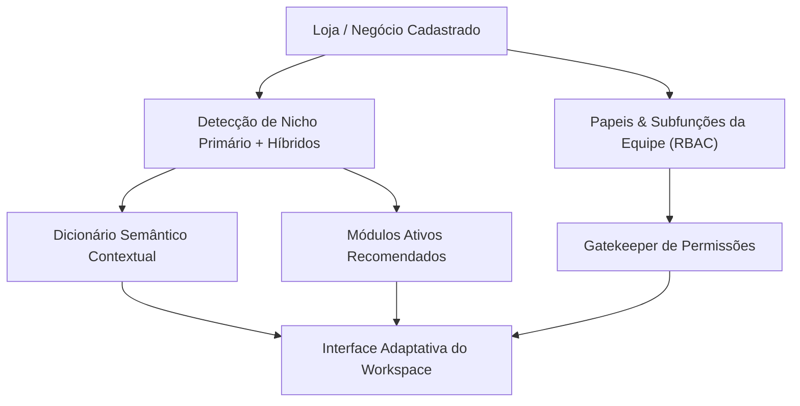

# MODULAR_CONTEXTUAL_SYSTEM_ARCHITECTURE.md — Arquitetura Modular Contextual, Semântica por Nicho & RBAC

> **Documento Canônico de Arquitetura, Semântica de Domínio e Governança Operacional — Plataforma JAH**  
> Elaborado pelo Conselho Executivo de Engenharia BigTech (CPO, Arquiteto Chefe, Engenharia de Dados & Segurança, Design Ops e QA Gatekeeper).

---

## 1. Visão Geral & Filosofia de Modularização Contextual

A plataforma **JAH** opera como um Super App Comunitário e Comercial Urbano. Para que o lojista/operador não se sinta sobrecarregado com menus genéricos ou ferramentas que não pertencem ao seu segmento, o **Workspace** adota uma **Arquitetura Modular Contextual Orientada a Nicho**.

### 🎯 Princípio Central:
> *"Um restaurante não gerencia 'SKUs de vestuário'; ele gerencia 'Pratos, Adicionais e Mesas'. Um salão de beleza não controla 'Tabelas de Frete por KM'; ele controla 'Cadeiras, Profissionais e Agendamentos'. A interface se adapta à mente do operador, e não o operador à interface."*



---

## 2. Inventário Canônico dos Módulos do Workspace

O Workspace da JAH é composto por **9 Grandes Famílias Modulares**, divididas em **Submódulos Atômicos**:

| Família Modular | Submódulos Canônicos | Finalidade Operacional | Tabelas Supabase Core |
|---|---|---|---|
| **1. Visão Geral & Inteligência** | - Visão Geral (`/workspace`)<br>- SimLab Enxame IA (`/workspace/simulacao`) | Dashboard de vendas, KPIs em tempo real e simulação de agentes IA. | `orders`, `profiles`, `ai_agent_simulations` |
| **2. Catálogo & Estoque** | - Produtos / Itens (`/workspace/catalogo/produtos`)<br>- Categorias (`/workspace/catalogo/categorias`)<br>- Coleções / Combos (`/workspace/catalogo/colecoes`)<br>- Atributos / Variações (`/workspace/catalogo/atributos`)<br>- Almoxarifado / Estoque (`/workspace/estoque`) | Gestão de itens vendáveis, grades de variação, insumos e estoque crítico. | `products`, `product_variants`, `categories`, `collections`, `inventory_levels` |
| **3. Vendas, PDV & CRM** | - Todos os Pedidos (`/workspace/pedidos`)<br>- Gestor de Pedidos Kanban (`/workspace/pedidos/gestor`)<br>- PDV Frente de Caixa (`/workspace/pdv`)<br>- Clientes / CRM (`/workspace/clientes`)<br>- Orçamentos & Propostas (`/workspace/orcamentos`) | Operação de vendas no balcão, esteira de produção e carteira de clientes. | `orders`, `order_items`, `customers`, `quotes`, `cash_register_shifts` |
| **4. Logística & Frota** | - Frota & Despacho (`/workspace/pedidos/frota`)<br>- Tabelas de Frete & KM (`/workspace/logistica/tabelas`)<br>- Faturas de Frota (`/workspace/logistica/faturas`)<br>- Cotações de Envio (`/workspace/configuracoes/fretes/cotacoes`) | Despacho de motoboys próprios/terceirizados, cálculo de frete e faturamento. | `delivery_trips`, `delivery_drivers`, `shipping_rates`, `driver_invoices` |
| **5. Serviços, Agenda & Passes** | - Grade de Agendamentos (`/workspace/agenda`)<br>- Catálogo de Serviços (`/workspace/agenda/servicos`)<br>- Profissionais & Salas (`/workspace/agenda/recursos`)<br>- Pacotes & Passes (`/workspace/pacotes`) | Agendamento de horários, bloqueio de grade, marcação de sessões e passes. | `appointments`, `services`, `service_resources`, `service_packages` |
| **6. Marketing & Monetização** | - Top Banners Vídeo/GIF (`/workspace/marketing/banners`)<br>- Cards Panorâmicos Hotpages (`/workspace/marketing/hotpages`)<br>- Patrocinadores Locais (`/workspace/marketing/patrocinadores`)<br>- Telemetria & Audiência (`/workspace/marketing/telemetria`)<br>- Promoções & Cupons (`/workspace/marketing/promocoes`)<br>- Campanhas & Ads (`/workspace/marketing/anuncios`)<br>- Gift Cards Digitais (`/workspace/marketing/gift-cards`) | Campanhas de atração, engajamento visual na vitrine e monetização local. | `banners`, `hotpage_cards`, `sponsors`, `telemetry_events`, `coupons`, `gift_cards` |
| **7. Financeiro & Caixa** | - Frente de Caixa / Sangrias (`/workspace/financeiro/caixa`)<br>- Afiliados & Split (`/workspace/financeiro/afiliados`)<br>- Comissões de Vendedores (`/workspace/financeiro/comissoes`) | Fechamento de turnos de caixa, split de pagamentos e comissionamento. | `cash_register_shifts`, `cash_movements`, `affiliate_commissions` |
| **8. Redação, CMS & Mídia** | - Notícias & Redação (`/workspace/noticias`)<br>- Nova Matéria (`/workspace/noticias/novo`)<br>- Calendário Editorial (`/workspace/cms/calendario`)<br>- Stories & Moments (`/workspace/cms/stories`)<br>- Biolink Autoral (`/workspace/cms/bio`)<br>- Estúdio / Builder (`/workspace/estudio`)<br>- Moderação Comunitária (`/workspace/moderacao`) | Criação de conteúdo editorial, zines, stories efêmeros e landing pages autorais. | `news_articles`, `stories`, `bio_links`, `builder_documents`, `moderation_flags` |
| **9. Configurações & Segurança** | - Dados da Empresa (`/workspace/configuracoes`)<br>- Unidades / Filiais (`/workspace/lojas`)<br>- Agentes IA & Prompts (`/workspace/configuracoes/ai`)<br>- Integrações Webhooks/APIs (`/workspace/configuracoes/integracoes`)<br>- Fornecedores & B2B (`/workspace/configuracoes/parceiros`) | Identidade da loja, gestão multi-unidade, webhooks e compliance. | `stores`, `store_settings`, `integrations`, `suppliers` |

---

## 3. Matriz Semântica Contextual por Nicho de Mercado

Para elevar a clareza operacional a nível BigTech, os módulos sofrem **adaptação semântica de vocabulário** no Backoffice de acordo com o nicho de atuação:

### 🍽️ 1. Nicho: Gastronomia, Restaurantes & Delivery
- **Produtos ➔** `Cardápio & Pratos`
- **Categorias ➔** `Seções do Cardápio (Entradas, Principais, Bebidas, Sobremesas)`
- **Atributos ➔** `Adicionais & Modificadores (Ponto da Carne, Borda Recheada, Molhos Extras)`
- **Estoque ➔** `Controle de Insumos & Porções Críticas`
- **Pedidos ➔** `Comandas & Pedidos de Delivery`
- **Gestor Kanban ➔** `KDS (Kitchen Display System / Fila da Cozinha)`
- **PDV ➔** `Caixa do Salão / Balcão`
- **Frota ➔** `Despacho de Motoboys & Raio de Entrega`
- **Módulos Recomendados Ativos:** `Catálogo`, `Vendas`, `Logística/Frota`, `Marketing`, `Financeiro/Caixa`.

### 🛒 2. Nicho: Mercados, Hortifrúti & Empórios
- **Produtos ➔** `Itens de Mercearia & Hortifrúti`
- **Categorias ➔** `Gôndolas & Corredores`
- **Atributos ➔** `Unidade de Medida (KG, Gramas, Dúzia, Unidade, Fardo)`
- **Estoque ➔** `Ruptura de Gôndola & Alerta de Validade`
- **PDV ➔** `Frente de Caixa Rápido com Leitor de Código de Barras (EAN)`
- **Clientes ➔** `Clube de Vantagens & Cashback Local`
- **Módulos Recomendados Ativos:** `Catálogo`, `Estoque Pesado`, `PDV Rápido`, `Marketing/Encartes`, `Financeiro`.

### 💈 3. Nicho: Beleza, Barbearias, Estética & Clínicas
- **Produtos ➔** `Cosméticos & Produtos de Manutenção Home Care`
- **Serviços ➔** `Procedimentos, Cortes & Tratamentos`
- **Recursos ➔** `Profissionais, Barbeiros, Terapeutas & Cadeiras`
- **Agenda ➔** `Grade de Horários & Atendimentos`
- **Pacotes ➔** `Planos Mensais, Assinaturas & Pacotes de Sessões`
- **Comissões ➔** `Repasse de Profissionais Parceiros (Split de Atendimento)`
- **Módulos Recomendados Ativos:** `Serviços/Agenda`, `Pacotes`, `Produtos/Homecare`, `Comissões`, `Marketing/Stories`.

### 🔨 4. Nicho: Serviços Técnicos, Engenharia & Obras Pesadas
- **Produtos ➔** `Insumos, Tubos, Brita, Areia & Peças`
- **Serviços ➔** `Locação de Maquinário, Terraplanagem, Instalações & Laudos`
- **Orçamentos ➔** `Propostas Técnicas & Ordens de Serviço (OS)`
- **Clientes ➔** `Contratos B2B & Medições de Obra`
- **Financeiro ➔** `Faturamento por Medição & Parcelamento Direto`
- **Módulos Recomendados Ativos:** `Catálogo/Insumos`, `Orçamentos/OS`, `Clientes/B2B`, `Financeiro`.

### 👗 5. Nicho: Moda, Calçados & Boutiques
- **Produtos ➔** `Peças & Acessórios`
- **Categorias ➔** `Departamentos (Feminino, Masculino, Infantil, Calçados)`
- **Atributos ➔** `Grade de Tamanhos (PP, P, M, G, GG, 36..44) & Cores`
- **Coleções ➔** `Lançamentos Cápsula & Estações (Primavera/Verão)`
- **Marketing ➔** `Lookbook, Zines & Stories de Provador`
- **Módulos Recomendados Ativos:** `Catálogo com Grade`, `Coleções`, `Zines/Estúdio`, `Marketing/Hotpages`, `Vendas/Envios`.

### 🏡 6. Nicho: Turismo, Hospedagem & Aluguel por Temporada
- **Produtos/Itens ➔** `Cabanas, Chalés, Suítes & Casas de Temporada`
- **Agenda ➔** `Calendário de Disponibilidade & Reservas`
- **Pacotes ➔** `Diárias, Tarifas de Fim de Semana & Feriados Prolongados`
- **Serviços ➔** `Passeios Turísticos, Taxa de Limpeza & Café Colonial`
- **Módulos Recomendados Ativos:** `Agenda/Reservas`, `Pacotes/Diárias`, `Marketing/Banners`, `Financeiro`.

### 📰 7. Nicho: Jornalismo, Mídia & Notícias Locais
- **Notícias ➔** `Matérias, Reportagens & Artigos de Opinião`
- **CMS ➔** `Calendário Editorial & Pautas da Semana`
- **Patrocinadores ➔** `Cotas de Publicidade & Anunciantes Locais`
- **Telemetria ➔** `Leituras, Audiência, Alcance & Leitores Ativos`
- **Módulos Recomendados Ativos:** `Notícias/Redação`, `CMS Editorial`, `Patrocinadores`, `Telemetria`, `Builder`.

---

## 4. Matriz de Permissões Granulares por Função (RBAC BigTech)

Seguindo o padrão de plataformas corporativas de ponta (como Meta Business Suite e Stripe Team Management), as permissões de acesso ao Workspace são estruturadas em **8 Funções Especializadas**:

```text
┌────────────────────────────────────────────────────────────────────────────────────────┐
│                        MATRIZ DE PAPEIS E PERMISSÕES NO WORKSPACE                     │
├───────────────────┬──────────────┬──────────────┬──────────────┬───────────────────────┤
│ Função / Papel    │ Catálogo/PDV │ Financeiro   │ Gestão/Equipe│ Marketing/Conteúdo    │
├───────────────────┼──────────────┼──────────────┼──────────────┼───────────────────────┤
│ 👑 Owner          │ TOTAL        │ TOTAL        │ TOTAL        │ TOTAL                 │
│ 👔 Manager        │ TOTAL        │ Leitura/Aprov│ Operacional  │ TOTAL                 │
│ 🏷️ Sales/Balcão   │ PDV + Criar  │ Apenas Caixa │ Sem acesso   │ Sem acesso            │
│ 💵 Cashier        │ PDV          │ Turno Próprio│ Sem acesso   │ Sem acesso            │
│ 📦 Stock/Almoxarife│ Produtos+Qtd │ Sem acesso   │ Sem acesso   │ Sem acesso            │
│ 🚚 Logistics      │ Despacho     │ Faturas Frete│ Sem acesso   │ Sem acesso            │
│ 🎨 Marketing      │ Leitura      │ Sem acesso   │ Sem acesso   │ TOTAL (Banners/News)  │
│ ✂️ ServiceProvider│ Agenda Própria│ Comissões Pró│ Sem acesso   │ Stories da Cadeira    │
└───────────────────┴──────────────┴──────────────┴──────────────┴───────────────────────┘
```

### Detalhamento das Funções:

1. **👑 Proprietário (`owner`):**
   - Acesso absoluto a todas as configurações fiscais, bancárias, de split, contratação de planos, exclusão de dados e permissões da equipe.
2. **👔 Gerente Geral (`manager`):**
   - Gestão diária de todas as operações de vendas, aprovação de orçamentos, ajustes de catálogo, moderação de comentários e relatórios gerenciais.
3. **🏷️ Vendedor / Balcão (`sales`):**
   - Operação de PDV, lançamento de pedidos, elaboração de orçamentos, consulta de estoque e cadastro de novos clientes.
4. **💵 Operador de Caixa (`cashier`):**
   - Abertura e fechamento do seu turno de caixa, sangrias, recebimentos (Pix, Cartão, Dinheiro) e emissão de comprovantes.
5. **📦 Estoquista / Almoxarife (`stock`):**
   - Entrada de notas de insumos/produtos, conferência física de inventário, alertas de ruptura e conferência de separação de pedidos.
6. **🚚 Despachante / Frota (`logistics`):**
   - Atribuição de pedidos a motoboys/motoristas parceiros, monitoramento de entregas em andamento e fechamento de faturas de frete.
7. **🎨 Marketing & Criação (`marketing`):**
   - Gestão de banners, vitrines hotpages, redação de matérias jornalísticas, stories, cupons promocionais e análise de audiência.
8. **✂️ Profissional / Prestador (`service_provider`):**
   - Visualização e agendamento exclusivo da sua grade de horários, confirmação de presença de clientes e acompanhamento de suas comissões de serviço.

---

## 5. Diretrizes de Otimização, Performance & Zero-Legacy Policy

Para garantir que a plataforma JAH mantenha tempos de resposta ultrarrápidos (<100ms) e consuma banda mínima em conexões móveis (3G/4G), adotamos 5 Pilares de Engenharia de Performance:

### 1. Code-Splitting Granular & Dynamic Imports
- Componentes pesados (como mapas WebGL `maplibre-gl`, renderizadores canvas do Builder e bibliotecas gráficas) NUNCA são carregados no bundle inicial.
- São importados dinamicamente via `React.lazy()` ou `import()` apenas quando a rota correspondente é ativada.

### 2. Zero-Legacy Policy (Política de Código Sempre Novo)
- Proibição de módulos "órfãos", componentes mockados ou rotas mortas que não se conectem a tabelas reais do Supabase.
- Todo código novo deve cumprir a **Completude Quádrupla**: Banco de Dados ➔ BFF Server Functions ➔ UI Canônica ➔ Gestão no Workspace.

### 3. Cache Inteligente no TanStack Start & SSR
- Consultas de leitura pública (Categorias, Banners, Vitrines) utilizam `staleTime: 60_000` (1 minuto) no TanStack Query com invalidação atômica em mutações (`queryClient.invalidateQueries`).

### 4. Otimização de Assets e Imagens
- Padronização de proporções com cropping obrigatório (`react-easy-crop`) no upload de banners (21:9 / 16:9), hotpages (16:10 / 4:3) e produtos (1:1 / 4:5), prevenindo desalinhamentos visuais e economizando dados móveis.

### 5. Silêncio Visual & Densidade Eficiente
- Interfaces de vitrine pública sem textos redundantes de boas-vindas.
- Workspace no **Paradigma Clean**: fundos puros (`bg-background`), bordas sutis (`border-border`), fontes de alta legibilidade e zero ruído decorativo.
