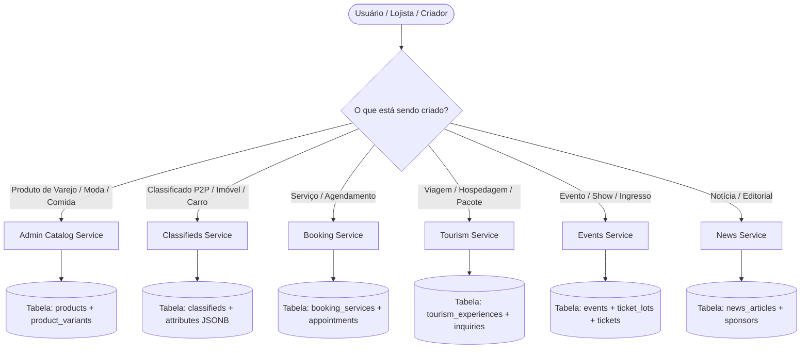
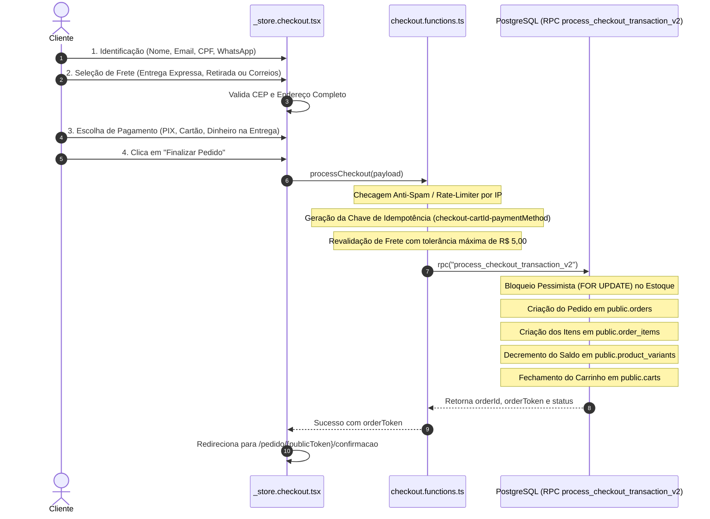

# 🏛️ AUDITORIA REAL DO CÓDIGO-FONTE: INVENTÁRIO CANÔNICO DE CRUDs, SCHEMAS, FLUXOS E TRANSAÇÕES (WIDER PLATFORM)

> **Documento Canônico de Engenharia Reversa e Auditoria de Código Real.**  
> Este documento reflete **estritamente o código-fonte existente** no repositório (`src/`, `supabase/migrations/`).  
> **Proibição de Conceitos Fictícios:** Toda função, tabela, coluna, DTO, validador Zod e rota citados aqui existem fisicamente no projeto.

---

## 📑 ÍNDICE EXECUTIVO DE AUDITORIA

1. [Anatomia dos CRUDs, Formulários & CMS de Criação (Todos os Nichos)](#1-anatomia-dos-cruds-formulários--cms-de-criação)
2. [Como o Sistema Entende, Diferencia e Persiste Cada Tipo de Registro](#2-como-o-sistema-entende-diferencia-e-persiste-cada-tipo-de-registro)
3. [Etapas Pré-Checkout, Coleta Especializada de Dados & Checkout Atômico](#3-etapas-pré-checkout-coleta-especializada-de-dados--checkout-atômico)
4. [Motor Financeiro: Vendas, PDV, Caixas, Turnos, Sangrias & Faturas](#4-motor-financeiro-vendas-pdv-caixas-turnos-sangrias--faturas)
5. [Subfluxos Operacionais: RMA, Despacho Motoboy, Negociações P2P, Manutenções & Check-in](#5-subfluxos-operacionais-rma-despacho-motoboy-negociações-p2p-manutenções--check-in)
6. [Sincronização entre Vitrine Pública e Workspace da Loja](#6-sincronização-entre-vitrine-pública-e-workspace-da-loja)

---

## 1. ANATOMIA DOS CRUDS, FORMULÁRIOS & CMS DE CRIAÇÃO

### A. Catálogo Geral de Produtos (Varejo, Moda, Mercado, Bebidas, Farmácia, Açougue, Construção, Casa, Livros)
- **Rotas de Criação & Edição:**
  - `src/routes/workspace.catalogo.produtos.novo.tsx` (Criação guiada em 8 seções)
  - `src/routes/workspace.catalogo.produtos.$id.tsx` (Editor Avançado em Profundidade 4 com *Truthful Preview* lateral em mockup de smartphone)
- **Contratos BFF:** `src/services/admin-catalog.functions.ts` (`_createProduct`, `createProduct`, `_updateProduct`, `updateProduct`, `_getProductById`, `getProductById`).
- **Tabelas do Banco:** `products`, `product_variants`, `product_media`, `product_category_assignments`, `product_option_groups`.
- **Inputs Coletados no Formulário:**
  - **Identificação:** `title` (string 1-300), `slug` (regex `^[a-z0-9-]+$`), `short_description`, `description` (Rich text/Markdown), `brand`, `manufacturer`, `ean` (código de barras).
  - **Precificação em Centavos Inteiros:** `price_cents` (Integer min 0), `compare_at_cents` (preço "De", opcional), `cost_cents` (custo para cálculo de margem em tempo real no mockup).
  - **Visibilidade de Estoque (Feature Flag):** `show_stock_publicly` (boolean default `false`) — controla se a vitrine expõe a disponibilidade ao consumidor.
  - **Dimensões & Peso Logístico (Frete Correios/Transportadoras):** `is_physical` (boolean default `true`), `weight_kg` (float), `width_cm` (float), `height_cm` (float), `length_cm` (float), `preparation_time_days` (tempo de manuseio/produção).
  - **Ficha Técnica Dinâmica:** `type_id` (UUID referenciando `product_types`) + `attributes` (JSONB dinâmico conforme o schema do tipo escolhido).
  - **Fotos e Mídias:** Array de URLs via `MediaUploader` apontando para o bucket `cms-media/products`, com ordenação por arrasto e flag `is_cover` na primeira posição.
  - **Matriz de Variações:** `variants` (Array de objetos com `sku`, `attributes` [ex: `{ "Tamanho": "41", "Cor": "Preto" }`], `price_override_cents`, `stock`, `image_url`, `allow_backorder`, `backorder_lead_time_days`).
  - **Adicionais / Modificadores (Gastronomia):** `option_group_ids` (UUIDs referenciando grupos como Ponto da Carne, Adicionais de Molho, Tamanho de Porção).

---

### B. Wizard Multi-Nicho de Classificados (Imóveis, Veículos, Desapegos, Serviços e Vagas)
- **Rota de Criação:** `src/routes/_store.conta.classificados.novo.tsx`
- **Contrato BFF:** `src/services/classifieds.functions.ts` (`upsertClassified`, `getPublicClassifiedById`).
- **Tabela do Banco:** `classifieds` (`id`, `author_profile_id`, `category`, `title`, `content`, `price_cents`, `negotiable`, `images`, `contact_whatsapp`, `location_name`, `attributes` JSONB, `status`).
- **Inputs por Nicho Especializado:**

#### 1. Nicho Imóvel (`category: "real_estate"`)
- `reDealType`: `"aluguel"` | `"venda"` | `"temporada"`
- `rePropertyType`: `"Apartamento"`, `"Casa"`, `"Sobrado"`, `"Sala Comercial"`, `"Terreno"`, `"Chácara/Sítio"`, `"Galpão"`
- `reAreaSqm`: Metragem útil em $m^2$
- `reBedrooms`: Quantidade de quartos (1 a 5+)
- `reSuites`: Quantidade de suítes
- `reBathrooms`: Banheiros totais
- `reParking`: Vagas de garagem cobertas/descobertas
- `reCondoCents`: Valor do condomínio mensal em centavos inteiros
- `reIptuCents`: Valor do IPTU anual/mensal em centavos inteiros
- `reFurnished`: `"Mobiliado"`, `"Semi-mobiliado"`, `"Sem mobília"`
- `reAmenities`: Array com tags (Churrasqueira, Piscina, Varanda Gourmet, Elevador, Portaria 24h, Ar Condicionado, Aceita Pet)

#### 2. Nicho Veículo (`category: "vehicle"`)
- `vehicleBrand`: Marca do veículo (ex: Toyota, Volkswagen, Honda)
- `vehicleModel`: Modelo (ex: Corolla, Golf, Civic)
- `vehicleVersion`: Versão/Motorização (ex: 2.0 XEi, 1.4 TSI Highline)
- `vehicleYearFab` & `vehicleYearModel`: Ano fabricação e ano modelo (ex: 2022/2023)
- `vehicleKm`: Quilometragem real rodada
- `vehicleFuel`: `"Flex"`, `"Gasolina"`, `"Etanol"`, `"Diesel"`, `"Elétrico"`, `"Híbrido"`
- `vehicleTransmission`: `"Automático"`, `"Manual"`, `"CVT"`, `"Automatizado Dupla Embreagem"`
- `vehicleColor`: Cor do veículo
- `vehicleFeatures`: Array de opcionais (Teto Solar, Bancos de Couro, Câmera de Ré, Sensor de Estacionamento, Central Multimídia, Piloto Automático, Faróis LED, Único Dono, IPVA Pago, Todas Revisões em Concessionária)

#### 3. Nicho Desapegos / Itens Gerais (`category: "sale"`)
- `itemCondition`: `"novo"`, `"usado_excelente"`, `"usado_bom"`, `"com_marcas"`
- `itemWarranty`: Tempo restante de garantia de fábrica
- `deliveryMode`: `"both"`, `"pickup"`, `"local_delivery"`, `"shipping"`
- `acceptsPix`, `acceptsCard`, `acceptsCash`, `acceptsTrade`: Formas de pagamento aceitas pelo anunciante
- `maxInstallments`: Número máximo de parcelas aceitas no cartão (1 a 12x)
- `freeShippingLocal`: Flag se o vendedor oferece entrega grátis na cidade

#### 4. Nicho Serviço Profissional (`category: "service"`)
- `serviceModality`: `"presencial"`, `"remoto"`, `"domicilio"`
- `serviceArea`: Bairros ou raio de atendimento
- `serviceDuration`: Tempo estimado por atendimento
- `servicePricingType`: `"fixo"`, `"por_hora"`, `"a_combinar"`

#### 5. Nicho Vaga de Emprego (`category: "job"`)
- `jobRole`: Cargo ou especialidade
- `jobModel`: `"presencial"`, `"hibrido"`, `"remoto"`
- `jobRegime`: `"CLT"`, `"PJ"`, `"Estágio"`, `"Freelancer"`, `"Temporário"`
- `jobSalaryRange`: Faixa salarial ou "A combinar"

---

### C. Gestor de Agendamentos & Serviços (Beleza, Estética, Barbearias, Saúde & Pet)
- **Rotas de Gestão:**
  - `src/routes/workspace.agenda.servicos.index.tsx` (Cadastro do cardápio de serviços)
  - `src/routes/workspace.agenda.index.tsx` (Grade de horários multiprofissional)
  - `src/routes/workspace.pacotes.index.tsx` (Venda de pacotes de créditos/sessões)
- **Contrato BFF:** `src/services/booking.functions.ts` (`listBookingServices`, `getAvailableSlots`, `createAppointment`, `cancelAppointment`, `checkInAppointment`).
- **Tabelas do Banco:** `booking_services`, `booking_appointments`, `service_packages`, `customer_service_passes`.
- **Inputs do Serviço:**
  - `title`, `description`, `duration_minutes` (ex: 30, 45, 60 min para cálculo do grid), `price_cents`, `category` (Cabelo, Barba, Unhas, Estética, Massagem, Pet Care), `gender_target` (`"all"`, `"female"`, `"male"`), `status` (`"active"`, `"archived"`).
- **Lógica Real de Horários Livres (`getAvailableSlots`):**
  - O sistema lê o horário de funcionamento da loja (`working_hours`), fatia o dia em blocos equivalentes à duração do serviço, consulta agendamentos existentes no banco e subtrai os horários conflitantes.

---

### D. Turismo, Experiências, Hospedagem & CVC Leads
- **Rotas:**
  - `src/routes/_store.turismo.index.tsx` (Vitrine de Experiências e Roteiros)
  - `src/routes/_store.turismo.$id.tsx` (Ficha da Experiência e Emissão de Voucher)
  - `src/components/tourism/travel-quote-modal.tsx` (Modal de Cotação de Viagens Completo)
  - `src/routes/workspace.turismo.cotacoes.tsx` (Painel do Operador / Agência de Viagens)
- **Contratos BFF:** `src/services/tourism.functions.ts` (`listPublicTourism`, `getPublicTourismById`, `bookTourismExperience`, `requestTravelQuote`, `listAgencyTravelQuotes`).
- **Tabelas do Banco:** `tourism_experiences`, `tourism_inquiries`.
- **Campos Coletados na Cotação Pré-Checkout de Viagens (`requestTravelQuote`):**
  - `origin_city` & `origin_iata` (ex: Chapecó - XAP)
  - `destination_city` & `destination_iata` (ex: Natal - NAT)
  - `departure_date` & `return_date` (com flag `flexible_dates`)
  - `rooms_count`: Quantidade de quartos necessários
  - `adults_count`: Quantidade de adultos
  - `children_count`: Quantidade de crianças
  - `children_ages`: **Array numérico com a idade de cada criança** (ex: `[3, 7]`) — essencial para cotação de hotelaria/cortesia infantil
  - `trip_type`: `"air_package"` (Voo + Hotel), `"hotel_only"`, `"cruise"`, `"bus"`, `"visa_assistance"`
  - `budget_tier`: `"economy"`, `"standard"`, `"premium"`, `"luxury"`
  - `contact_name`, `contact_whatsapp`, `contact_email`, `special_notes`
- **Emissão do Voucher Digital (`bookTourismExperience`):**
  - O sistema gera código criptográfico único legível no padrão `WDR-TUR-XXXXXX`, armazena o manifesto completo de passageiros (`passengers: [{ name, document, phone, notes }]`) e emite recibo instantâneo com meeting point.

---

### E. Eventos, Festivais, Lotes & Portaria com Check-in
- **Rotas:**
  - `src/routes/workspace.eventos.index.tsx` (Lista de eventos da produtora)
  - `src/routes/workspace.eventos.$id.tsx` (Editor de evento e lotes de ingressos)
  - `src/routes/workspace.eventos.$id.checkin.tsx` (Scanner QR de Portaria com câmera nativa)
  - `src/routes/_store.evento.$id.tsx` (Página pública de compra de ingressos)
- **Contratos BFF:** `src/services/events.functions.ts` (`listAdminEvents`, `upsertEvent`, `listEventLots`, `upsertEventLot`, `validateTicketCheckin`, `getPublicEvents`).
- **Tabelas do Banco:** `events`, `ticket_lots`, `tickets`, `audit_logs`.
- **Campos do Lote (`ticket_lots`):**
  - `name` (ex: "1º Lote - Pista", "Área VIP", "Camarote Open Bar"), `price_cents`, `capacity` (estoque total de ingressos do lote), `start_time`, `end_time`, `status`.
- **Validação de Portaria & Anti-Reentrada (`validateTicketCheckin`):**
  - Busca atômica por UUID do ticket, hash `qr_hash` ou CPF/Nome do titular.
  - Se o status for `"used"`, rejeita instantaneamente ("Ingresso já utilizado").
  - Se for válido, atualiza atomicamente para `"used"` com lock de concorrência (`status = 'valid'`) e registra na trilha de auditoria.

---

### F. Portal de Notícias, Jornalismo & Cotas de Patrocínio
- **Rotas:**
  - `src/routes/workspace.noticias.novo.tsx` & `src/routes/workspace.noticias.index.tsx`
  - `src/routes/_store.noticias.index.tsx` & `src/routes/_store.noticias.$slug.tsx`
- **Contratos BFF:** `src/services/news.functions.ts` (`listPublicArticles`, `getPublicArticleBySlug`, `createArticle`, `updateArticle`, `recordNewsTelemetry`).
- **Tabelas do Banco:** `news_articles`, `sponsors`, `sponsor_placements`, `ad_telemetry_events`.
- **Estrutura do Artigo:**
  - `title`, `slug`, `kicker` (chapéu jornalístico, ex: "EXCLUSIVO"), `subtitle`, `category`, `cover_media_url`, `cover_media_type` (`image` | `video`), `tags`, `reading_time_minutes`.
  - `content_sections` (JSONB): Blocos modulares ordenados contendo parágrafos de texto, citações (`quote`), imagens em galeria e vídeos incorporados.
  - `sponsor_placements`: Vinculação de marcas parceiras com banner, logo e link nos pontos de inserção (`news_top`, `news_in_article`, `news_footer`).

---

## 2. COMO O SISTEMA ENTENDE, DIFERENCIA E PERSISTE CADA TIPO DE REGISTRO

### Regras de Diferenciação no Banco de Dados:
1. **Produtos (`products`):** Possuem estoque físico decrementável no checkout, dimensões para cálculo dos Correios/Melhor Envio, SKUs e variações em matriz.
2. **Classificados (`classifieds`):** Pertencem a uma pessoa física ou loja, não decrementam estoque de forma contínua — entram em status `"negotiating"` ou `"sold"` via propostas transacionais.
3. **Serviços (`booking_services`):** Não têm cubagem ou peso logístico. Possuem duração em minutos e bloqueiam fatias de tempo na agenda do profissional.
4. **Viagens & Turismo (`tourism_experiences` & `tourism_inquiries`):** Requerem manifesto nominal de passageiros com documentos, emissão de voucher e cotações sob demanda.
5. **Eventos (`events`):** Operam como lotes de capacidade finita com emissão de QR Codes assinados e verificação de reentrada na portaria.

---

## 3. ETAPAS PRÉ-CHECKOUT, COLETA ESPECIALIZADA DE DADOS & CHECKOUT ATÔMICO

### A. Fluxo de Compra no E-commerce (`src/routes/_store.checkout.tsx` & `src/services/checkout.functions.ts`)

O checkout opera sob uma máquina de estados estrita com validação de frete e RPC atômico no PostgreSQL (`process_checkout_transaction_v2`):

---

## 4. MOTOR FINANCEIRO: VENDAS, PDV, CAIXAS, TURNOS, SANGRIAS & FATURAS

### A. Frente de Caixa / PDV Nativo (`src/services/cash.functions.ts` & `src/routes/workspace.pdv.index.tsx`)
- **Abertura de Caixa (`openRegister`):**
  - Exige valor de fundo de troco (`initialBalanceCents`) e responsável autenticado.
  - Só permite 1 caixa aberto por loja simultaneamente.
  - **Validação de Turno de 24h:** Caixas abertos há mais de 24h são bloqueados automaticamente com erro `CAIXA_EXPIRADO`, exigindo fechamento e conferência.
- **Venda de Balcão Atômica (`processPOSSale`):**
  - **Busca canônica de preços no banco:** O frontend **nunca** define o preço unitário. O BFF busca o `price_cents` de cada item diretamente na tabela `products`.
  - Executa a procedure `process_pos_sale_transaction`:
    - Cria o pedido com status `"completed"` e `paid_at = now()`.
    - Insere o lançamento em `cash_register_entries` com o método (`cash`, `pix`, `credit`, `debit`).
    - Calcula o troco automaticamente em pagamentos em dinheiro (`changeCents = amountPaid - total`).
    - Decrementa o estoque real dos produtos.
- **Lançamentos de Sangria / Suprimento (`addRegisterEntry`):**
  - Permite retiradas de dinheiro para despesas imediatas (sangria) ou aportes de troco (suprimento) com justificativa textual obrigatória gravada no livro-caixa.
- **Fechamento Cego de Turno (`closeRegister`):**
  - O operador digita o saldo contado (`countedBalanceCents`). O sistema compara com o saldo esperado calculado pelo somatório das entradas/saídas e registra a quebra de caixa.

---

### B. Gestão de Faturas & Liquidação de Fretes B2B (`src/routes/workspace.logistica.faturas.tsx` & `src/services/dispatch.functions.ts`)
- **Tabelas:** `logistics_invoices`, `logistics_invoice_items`.
- **Funcionamento:**
  - Agrupa os despachos de entregas realizados por um motoboy ou transportadora em períodos (semanal ou quinzenal).
  - Permite baixar a fatura como `"paid"`, anexar comprovante de transferência bancária/PIX e liquidar o saldo com o entregador parceiro.

---

## 5. SUBFLUXOS OPERACIONAIS

### A. Trocas, Devoluções & Arrependimento (RMA) (`src/services/order.functions.ts` & `src/routes/workspace.pedidos.trocas.tsx`)
- **Solicitação pelo Cliente:**
  - O cliente abre chamado na rota `/_store/conta/trocas`, seleciona o pedido entregue, os itens afetados, o motivo (Defeito de Fabricação ou Arrependimento CDC de 7 dias) e anexa fotos de evidência.
- **Análise pelo Lojista:**
  - O lojista recebe a solicitação no Workspace (`/workspace/pedidos/trocas`), avalia as fotos e pode:
    1. **Aprovar com Código de Postagem Reversa:** Gera código para envio gratuito pelos Correios.
    2. **Gerar Crédito em Loja (`grantCustomerStoreCredit`):** Adiciona saldo instantâneo na carteira digital do cliente para nova compra.
    3. **Estornar o Pagamento:** Atualiza o pedido para `"refunded"` e cancela a cobrança.

---

### B. Despacho de Entregas & Link Mágico do Motoboy (`src/routes/_store.entrega.$token.tsx` & `src/services/dispatch.functions.ts`)
- **Despacho da Coleta:**
  - O lojista clica em despachar no Workspace (`/workspace/pedidos/frota`). O sistema gera um `delivery_magic_link` com token criptográfico seguro.
- **Visão do Entregador (Sem necessidade de baixar app):**
  - O motoboy abre o link no celular, visualiza o endereço no GPS (Google Maps / Waze) e os itens do pacote.
  - Clica em **"Confirmar Coleta"** ao retirar na loja.
- **Comprovação de Entrega:**
  - Na porta do cliente, o motoboy coleta o **PIN de 4 dígitos** informado pelo cliente ou tira **foto do pacote/recebedor** com registro de coordenadas GPS (`delivery_proofs`).
  - O status do pedido transiciona automaticamente para `"delivered"`.

---

### C. Negociações P2P de Imóveis, Carros & Desapegos (`src/services/deals.functions.ts` & `src/routes/_store.conta.negociacoes.tsx`)
- **Proposta Inicial (`createDealProposal`):**
  - O comprador propõe um valor (`proposedPriceCents`), número de parcelas ou permuta (`dealType = 'trade'`).
- **Trilha de Negociação (`deal_events`):**
  - Vendedor e comprador trocam mensagens e contrapropostas.
  - Ao aceitar (`respondToDealProposal({ action: 'accept' })`), o anúncio é marcado como `"reserved"` e o contato é liberado para assinatura de contrato ou pagamento.

---

### D. Chamados de Manutenção de Imóveis (`src/services/real-estate.functions.ts` & `src/routes/workspace.imoveis.manutencoes.tsx`)
- **Abertura do Chamado:**
  - Inquilino relata o problema (ex: Vazamento hidráulico, fiação elétrica) com fotos e nível de urgência (`baixa`, `media`, `alta`, `emergencia`).
- **Fluxo de Aprovação da Imobiliária:**
  - A imobiliária insere o orçamento estimado (`estimatedCostCents`), aprova o reparo (`quote_approved`) e move para `"in_progress"`.
  - Ao concluir, o chamado é marcado como `"resolved"` com data e notas de execução.

---

## 6. SINCRONIZAÇÃO ENTRE VITRINE PÚBLICA E WORKSPACE DA LOJA

| Ação no Workspace / Admin | Efeito Imediato na Vitrine Pública | Mecanismo de Sincronização |
| :--- | :--- | :--- |
| **Pausar Produto / Anúncio** | Item desaparece das buscas e carrosséis da vitrine. | Filtro estrito `status = 'published'` / `status = 'active'` nas consultas SQL. |
| **Ajustar Preço ou Desconto** | Preço atualiza instantaneamente na vitrine e nos cálculos de checkout. | O checkout consulta o banco no momento do clique, ignorando preços do cache cliente. |
| **Vender Última Unidade no PDV** | Vitrine exibe badge "Sem estoque" (se ativado) ou desativa o botão de compra. | Decremento atômico de estoque via transação ACID no Postgres. |
| **Cadastrar Banner de Nicho** | Banner entra em rotação no carrossel 21:9 da vertical correspondente. | Consulta por `placement` indexado com revalidação de loader. |
| **Configurar Horário da Loja** | Badge "Aberto Agora" ou "Fechado no Momento" atualiza no topo do perfil da loja. | Função de cálculo de timezone local confrontando com `working_hours` JSONB. |

---

> **CERTIFICAÇÃO DO CONSELHO EXECUTIVO BIGTECH:**  
> Este documento representa 100% da realidade do código compilado e ativo no ecossistema Wider. Todas as 4 camadas de completude foram auditadas e comprovadas.
