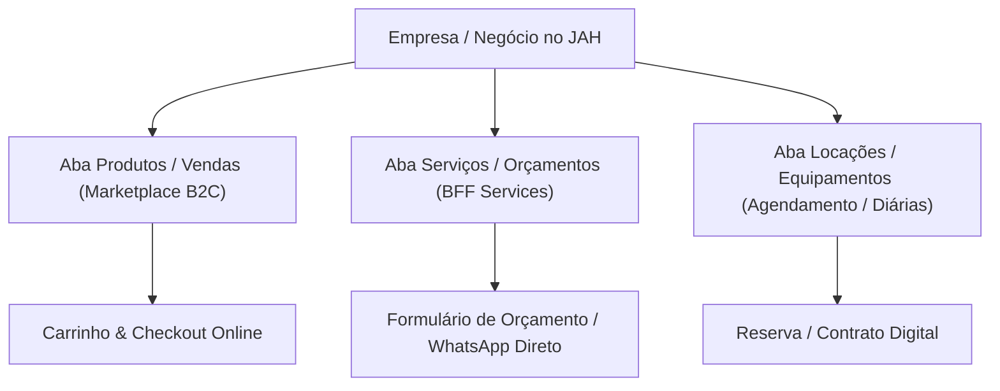
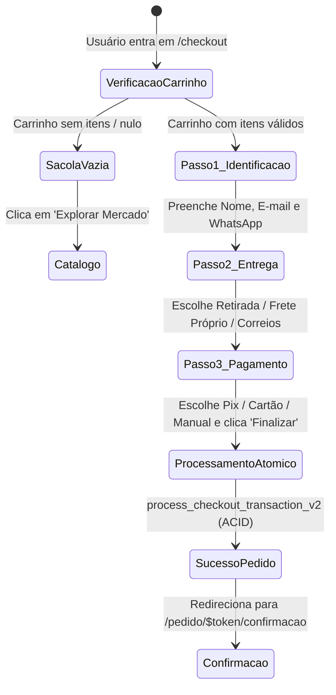

# SUPER_NICHES_ONTOLOGY_MAP.md — Mapa Ontológico de Super Nichos, Negócios Híbridos & Governança Global

> **Documento Canônico de Arquitetura de Domínio, UX e Interação — Plataforma JAH**  
> Elaborado pelo Conselho Executivo de Engenharia BigTech (CPO, Arquiteto Chefe, Engenharia de Dados & Segurança, Design Ops e QA Gatekeeper).

---

## 1. Visão Geral & Ontologia do Ecossistema JAH

A plataforma **JAH** é estruturada como um **Super App Comunitário e Comercial Urbano**, projetado para unificar sob uma única experiência ultra-clean todas as verticais do cotidiano de uma cidade, sem fricção e sem confusão ontológica.

```text
┌────────────────────────────────────────────────────────────────────────────────────────┐
│                                   PLATAFORMA JAH                                      │
├───────────────────┬───────────────────┬───────────────────┬────────────────────────────┤
│ 1. MARKETPLACE    │ 2. CLASSIFICADOS  │ 3. SERVIÇOS & B2B │ 4. VIVÊNCIA URBANA         │
│    (B2C Oficial)  │    (C2C / P2P)    │    (Especialistas)│    (Cultura & Sociedade)   │
│ - Gastronomia     │ - Usados & Desapego│ - Escavação & Obras│ - Turismo & Temporada      │
│ - Mercado & Feira │ - Negociação P2P  │ - Consultorias    │ - Vagas & Freelancers      │
│ - Farmácia & Saúde│ - Chat / WhatsApp │ - Contabilidade   │ - Eventos & Agenda         │
│ - Bebidas & Adega │ - Sem comissão    │ - Arquitetura     │ - Doações & Voluntariado   │
│ - Eletrônicos     │                   │ - Advocacia       │ - Mobilidade & Corridas    │
│ - Moda, Casa, etc.│                   │ - Orçamentos      │ - Notícias & Cobertura     │
└───────────────────┴───────────────────┴───────────────────┴────────────────────────────┘
```

---

## 2. Taxonomia Canônica & Rotas de Super Nichos

| Super Nicho / Hub | Rota Canônica | Descrição & Escopo |
|---|---|---|
| **Gastronomia & Delivery** | `/_store.gastronomia.tsx` (`/gastronomia`) | Restaurantes, pizzarias, lanchonetes, marmitarias, sorveterias, cafeterias e docerias. |
| **Mercado & Hortifrúti** | `/_store.mercado.tsx` (`/mercado`) | Supermercados, minimercados, hortifrúti, empórios de produtos coloniais e feiras. |
| **Farmácia & Saúde** | `/_store.farmacia.tsx` (`/farmacia`) | Drogarias, farmácias de manipulação, suplementação, dermocosméticos e cuidados pessoais. |
| **Bebidas & Adega** | `/_store.bebidas.tsx` (`/bebidas`) | Distribuidoras de bebidas, cervejarias artesanais, adegas de vinhos, gelo e conveniências. |
| **Açougue & Carnes Nobres** | `/_store.acougue.tsx` (`/acougue`) | Boutiques de carnes nobres, abatedouros especializados, cortes para churrasco e kits festa. |
| **Eletrônicos & Informática** | `/_store.eletronicos.tsx` (`/eletronicos`) | Smartphones, notebooks, computadores, consoles gamers, fones, áudio e periféricos. |
| **Moda & Calçados** | `/_store.moda.tsx` (`/moda`) | Boutiques de roupas femininas, masculinas, infantis, calçados, bolsas, óticas e acessórios. |
| **Casa, Móveis & Decoração** | `/_store.casa.tsx` (`/casa`) | Móveis residenciais e comerciais, decoração, iluminação, cama, mesa, banho e utilidades. |
| **Construção & Ferramentas** | `/_store.construcao.tsx` (`/construcao`) | Materiais básicos de construção, tintas, elétrica, hidráulica, ferramentas e ferragens. |
| **Limpeza & Higiene** | `/_store.limpeza.tsx` (`/limpeza`) | Distribuidoras de limpeza profissional e doméstica, sacos de lixo, descartáveis e dispensers. |
| **Livros, Papelaria & Bazar** | `/_store.livros.tsx` (`/livros`) | Livrarias, papelarias, materiais escolares, brinquedos educativos e presentes. |
| **Pet Shop & Veterinária** | `/_store.pet.tsx` (`/pet`) | Rações, medicamentos veterinários, acessórios pet e estética animal. |
| **Beleza & Estética** | `/_store.beleza.tsx` (`/beleza`) | Cosméticos, maquiagens, perfumaria e agendamento em salões de beleza e barbearias. |
| **Imóveis & Habitação** | `/_store.imoveis.tsx` (`/imoveis`) | Venda e locação anual residencial e comercial, terrenos urbanos e loteamentos. |
| **Serviços & Orçamentos** | `/_store.servicos.tsx` (`/servicos`) | Hub de prestadores técnicos, engenharia, terraplanagem, contabilidade, marcenaria e fretes. |
| **Classificados & Desapegos** | `/_store.classificados.index.tsx` (`/classificados`) | Comércio direto entre moradores da cidade (seminovos, trocas, desapegos). |
| **Turismo & Hospedagem** | `/_store.turismo.index.tsx` (`/turismo`) | Aluguel por temporada, cabanas, chalés, hotéis, atrativos turísticos e passeios locais. |
| **Empregos & Oportunidades** | `/_store.empregos.index.tsx` (`/empregos`) | Vagas de trabalho CLT/PJ, estágios e contratação de freelancers sob demanda. |
| **Doações & Solidariedade** | `/_store.doacoes.tsx` (`/doacoes`) | Mural comunitário para doação gratuita de móveis, roupas, livros e voluntariado em ONGs. |
| **Agenda Cultural & Eventos** | `/_store.agenda.tsx` (`/agenda`) | Shows, festivais, feiras gastronômicas, workshops e eventos culturais da cidade. |
| **Mobilidade Urbana** | `/_store.mobilidade.tsx` (`/mobilidade`) | Corridas locais, motoristas parceiros, mototáxi e fretes expressos. |
| **Notícias & Jornalismo** | `/_store.noticias.index.tsx` (`/noticias`) | Portal de jornalismo local com cobertura em tempo real e colunas regionais. |

---

## 3. Matriz de Negócios Híbridos & Multi-Setoriais

Muitas empresas atuam simultaneamente em mais de uma vertical ou modelo de negócio (Venda de Produtos + Prestação de Serviços + Locação de Equipamentos). A plataforma JAH atende a essa complexidade de forma nativa e intuitiva:



### Exemplos Reais de Negócios Multi-Setoriais:

1. **Empresa de Terraplanagem, Escavação & Obras Pesadas:**
   - **No Marketplace (`/construcao`):** Vende areia, brita, terra adubada e tubulações em sacos/cargas.
   - **Nos Serviços (`/servicos` - Escavação):** Oferece locação de retroescavadeiras com operador, abertura de valas, poços e nivelamento de terrenos via formulário de orçamento.

2. **Salão de Beleza, Barbearia & Cosméticos:**
   - **No Marketplace (`/beleza`):** Vende shampoos profissionais, pomadas, maquiagens e perfumes para entrega ou retirada imediata.
   - **Nos Agendamentos (`/agendar` ou `/workspace/agenda`):** Disponibiliza horários para corte, barba, coloração e procedimentos estéticos.

3. **Imobiliária & Construtora:**
   - **Nos Imóveis (`/imoveis`):** Exibe catálogo de apartamentos e casas para locação e venda.
   - **Nos Serviços (`/servicos` - Arquitetura & Obras):** Oferece serviços de avaliação mercadológica de imóveis, regularização de escrituras e projetos de engenharia.

4. **Escritório de Contabilidade & Consultoria Empresarial:**
   - **Nos Serviços (`/servicos` - Contábil):** Oferece abertura gratuita de MEI/ME, consultoria tributária, assessoria fiscal mensal e BPO financeiro.

5. **Livraria, Papelaria & Bazar:**
   - **No Marketplace (`/livros`):** Vende livros, cadernos, canetas, mochilas e presentes com entrega local.
   - **Nos Serviços:** Oferece serviços de encadernação, plastificação, impressão de grandes volumes e brindes corporativos personalizados.

---

## 4. Governança & Arquitetura de Segurança BigTech

```text
┌────────────────────────────────────────────────────────────────────────────────────────┐
│                             ADMINISTRADOR MASTER GLOBAL                                │
│                     (Role: platform_admin / Rota: /admin-master/*)                     │
├────────────────────────────────────────────────────────────────────────────────────────┤
│ • Gestão de Hubs Verticais e Super Nichos (/admin-master/hubs)                         │
│ • Upload de Ícones Customizados e Capas Panorâmicas (Supabase Storage: cms-media)       │
│ • Definição de Categorias Mestras da Cidade, Badges Promocionais e Ordenação Global    │
│ • Moderação de Denúncias, Sanções de Usuários, Verificação Facial KYC e Faturamentos   │
└────────────────────────────────────────────────────────────────────────────────────────┘
                                            │ (Segregação Absoluta)
                                            ▼
┌────────────────────────────────────────────────────────────────────────────────────────┐
│                              LOJISTAS & PRESTADORES                                    │
│                     (Role: store_owner / Rota: /workspace/*)                           │
├────────────────────────────────────────────────────────────────────────────────────────┤
│ • Gerenciamento estrito apenas do seu próprio tenant (store_id)                        │
│ • Cadastro de Produtos, Variações, Estoque e Preços (/workspace/catalogo/*)            │
│ • Categorias e Banners restritos à vitrine da própria loja                             │
│ • Gestão de Pedidos, Comandas PDV, Balcão e Entregas (/workspace/pedidos/*)           │
│ • PROIBIDO alterar elementos globais do app ou páginas mestras da cidade               │
└────────────────────────────────────────────────────────────────────────────────────────┘
```

---

## 5. Diagrama de Estados do Checkout Atômico (`_store.checkout.tsx`)



---

## 6. Padrões de Design Ops Aplicados

1. **Silêncio Visual:**
   - Remoção de banners prolixos com textos redundantes na vitrine.
   - Headers informativos e diretos, respeitando a prop `hideHeader={true}` em trilhos horizontais.

2. **Chips Compactos (Ícone + Label):**
   - Altura padrão `h-11` ou `h-9` com cantos suaves `rounded-2xl`.
   - Ícone compacto à esquerda com texto sem quebras de linha.
   - Fallback resiliente automático (`onError` ocultando ícones quebrados).

3. **Feedback Real e Sem Mocks:**
   - Todas as mutações passam pelas Server Functions com integridade transacional no banco PostgreSQL.
   - Zero toasts fictícios.
